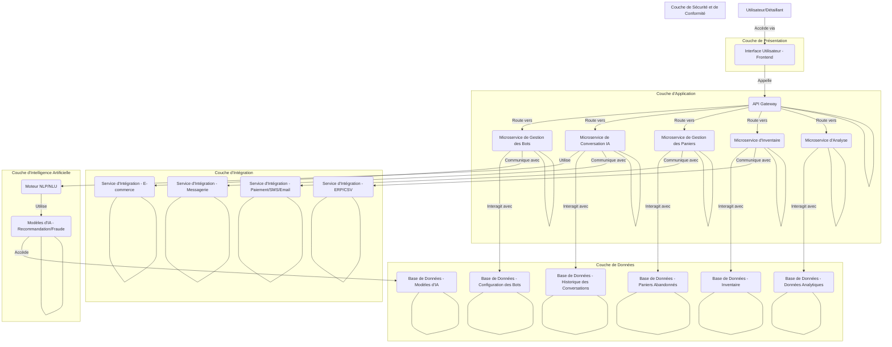

# Planification et Conception de l'Architecture de RetailBot Factory

## Introduction

Ce document détaille le plan architectural pour le développement de l'application "RetailBot Factory", une plateforme d'IA autonome et multilingue conçue pour les détaillants et les opérateurs de commerce électronique, en particulier dans les marchés émergents. L'objectif principal de cette application est de permettre aux entreprises de concevoir, déployer et gérer des assistants de magasin personnalisés basés sur l'IA sans nécessiter de connaissances techniques approfondies. Ce plan couvrira les aspects clés de l'architecture logicielle, y compris les composants principaux, les technologies utilisées, les intégrations, la sécurité, la scalabilité et la stratégie de déploiement.

## Objectifs du Projet

L'objectif principal de RetailBot Factory est de démocratiser l'accès à l'intelligence artificielle pour les petites et moyennes entreprises (PME) et les opérateurs de commerce électronique, en particulier ceux situés dans les marchés émergents. En fournissant une solution sans code, la plateforme vise à éliminer les barrières techniques, permettant ainsi aux entreprises de toutes tailles de tirer parti des avantages des assistants IA. Les objectifs spécifiques incluent :

*   **Autonomie et Multilinguisme :** Développer un agent IA capable de fonctionner de manière autonome et de communiquer efficacement dans plusieurs langues, notamment l'arabe, le français et l'anglais, avec une extensibilité vers d'autres langues comme le tamazight.
*   **Personnalisation et Facilité d'Utilisation :** Offrir une interface utilisateur intuitive et sans code (glisser-déposer) permettant aux détaillants de personnaliser leurs assistants IA en fonction de leurs besoins spécifiques, sans nécessiter de compétences en programmation.
*   **Fonctionnalités Clés pour le Commerce de Détail :** Intégrer des capacités essentielles telles que les recommandations de produits, l'assistance aux commandes, la gestion des FAQ, la récupération des paniers abandonnés, la détection de fraude pour le paiement à la livraison (COD), et le suivi des stocks.
*   **Analyse et Intelligence Commerciale :** Fournir un tableau de bord analytique visuel offrant des informations exploitables sur le comportement des clients, la performance des produits et l'optimisation des prix, afin d'aider les détaillants à prendre des décisions éclairées.
*   **Intégrations Robustes :** Assurer une intégration transparente avec les plateformes de commerce électronique populaires (Shopify, WooCommerce, Jumia DZ), les services de messagerie (WhatsApp Business, Messenger) et les passerelles de paiement locales.
*   **Scalabilité et Rentabilité :** Concevoir une architecture qui supporte une croissance rapide du nombre d'utilisateurs et de transactions, tout en maintenant une structure de coûts viable pour les PME, avec des modèles de monétisation flexibles (freemium, pro-tier, partenariats).
*   **Conformité et Sécurité :** Mettre en œuvre des mesures de sécurité robustes et des logiques de conformité (similaires au GDPR) pour la gestion des données sensibles des clients.

Ces objectifs guideront toutes les phases de conception et de développement, assurant que l'application finale répond aux besoins du marché cible et offre une valeur ajoutée significative aux utilisateurs.

## Architecture Générale du Système

L'architecture de "RetailBot Factory" sera conçue comme un système modulaire et évolutif, basé sur une approche de microservices pour garantir la flexibilité, la résilience et la facilité de maintenance. Chaque module sera responsable d'une fonctionnalité spécifique, permettant un développement et un déploiement indépendants. L'ensemble du système sera hébergé sur une infrastructure cloud pour assurer la scalabilité et la disponibilité.

Le système se composera des couches principales suivantes :

1.  **Couche de Présentation (Frontend) :** Cette couche sera responsable de l'interface utilisateur et de l'expérience. Elle inclura l'interface utilisateur sans code (No-Code AI Builder UI) pour la configuration des bots, le tableau de bord analytique, et les interfaces pour les détaillants. Elle sera développée en utilisant des technologies web modernes pour assurer une réactivité et une compatibilité multi-appareils.

2.  **Couche d'Application (Backend) :** C'est le cœur logique du système, où la plupart des traitements et des interactions avec les données auront lieu. Cette couche sera composée de plusieurs microservices, chacun gérant une fonctionnalité spécifique de l'application (par exemple, le service de conversation IA, le service de gestion des paniers, le service d'inventaire, le service d'intégration, etc.). Ces services communiqueront entre eux via des APIs RESTful ou des files d'attente de messages.

3.  **Couche de Données :** Cette couche sera responsable du stockage et de la récupération de toutes les données de l'application. Elle inclura des bases de données relationnelles pour les données structurées (informations sur les détaillants, configurations des bots, données de commande) et potentiellement des bases de données NoSQL pour les données non structurées ou semi-structurées (logs de conversation, données analytiques brutes). Une attention particulière sera portée à la sécurité et à la performance des bases de données.

4.  **Couche d'Intégration :** Cette couche gérera toutes les communications externes avec des services tiers. Elle inclura des connecteurs pour les plateformes de commerce électronique (Shopify, WooCommerce, Jumia DZ), les services de messagerie (WhatsApp Business, Messenger), les passerelles de paiement et les systèmes ERP locaux. Des APIs robustes seront exposées pour permettre des intégrations futures.

5.  **Couche d'Intelligence Artificielle :** Cette couche sera dédiée aux modèles d'IA et aux algorithmes. Elle comprendra le moteur de traitement du langage naturel (NLP) pour le chatbot, les modèles de recommandation, les algorithmes de détection de fraude pour le COD, et les modèles d'analyse prédictive pour le tableau de bord. Cette couche sera conçue pour être extensible, permettant l'ajout de nouveaux modèles d'IA à l'avenir.

6.  **Couche de Sécurité et de Conformité :** Cette couche transversale sera intégrée à tous les niveaux de l'architecture pour assurer la protection des données, l'authentification, l'autorisation et la conformité aux réglementations (par exemple, les principes du GDPR). Elle inclura des mécanismes de chiffrement, de gestion des identités et des accès (IAM), et de journalisation des audits.

Voici un aperçu schématique de l'architecture générale :

Cette architecture permettra une grande flexibilité et une évolutivité pour répondre aux besoins futurs de l'application et à l'augmentation du nombre d'utilisateurs. Chaque composant sera développé avec une attention particulière à la performance, à la sécurité et à la maintenabilité.

## Technologies Clés

Le choix des technologies est crucial pour assurer la robustesse, la scalabilité et la maintenabilité de "RetailBot Factory". Nous privilégierons des technologies open-source et des frameworks éprouvés, largement adoptés par la communauté des développeurs, afin de faciliter le développement, l'intégration et la maintenance à long terme. Voici une liste des technologies clés envisagées pour chaque couche de l'architecture :

### 1. Couche de Présentation (Frontend)

*   **Framework JavaScript :** React.js ou Vue.js. Ces frameworks offrent une approche basée sur les composants, facilitant le développement d'interfaces utilisateur complexes et réactives. Ils sont également très performants et bénéficient d'une large communauté.
*   **Langage :** TypeScript. Pour une meilleure maintenabilité et la détection précoce des erreurs.
*   **Styling :** Tailwind CSS ou Styled Components. Pour un développement rapide et des styles modulaires.
*   **Outil de construction (Build Tool) :** Webpack ou Vite. Pour optimiser les performances et le processus de développement.

### 2. Couche d'Application (Backend - Microservices)

*   **Langage de Programmation :** Python (avec Flask ou FastAPI) ou Node.js (avec Express.js). Python est excellent pour l'IA et le traitement des données, tandis que Node.js est performant pour les applications en temps réel et les APIs.
*   **Conteneurisation :** Docker. Pour empaqueter les microservices et assurer la cohérence des environnements de développement et de production.
*   **Orchestration :** Kubernetes. Pour la gestion, le déploiement et la scalabilité des conteneurs Docker en production.
*   **API Gateway :** Nginx ou un service cloud géré (par exemple, AWS API Gateway, Google Cloud Endpoints). Pour gérer les requêtes entrantes, l'authentification et le routage vers les microservices appropriés.
*   **File d'attente de messages :** RabbitMQ ou Apache Kafka. Pour la communication asynchrone entre les microservices, la gestion des événements et la résilience.

### 3. Couche de Données

*   **Base de Données Relationnelle :** PostgreSQL. Pour les données structurées (utilisateurs, configurations de bots, commandes). PostgreSQL est robuste, extensible et supporte des fonctionnalités avancées.
*   **Base de Données NoSQL :** MongoDB ou Cassandra. Pour les données non structurées ou semi-structurées (logs de conversation, données analytiques brutes, données de capteurs). MongoDB est flexible et facile à utiliser, tandis que Cassandra est idéale pour les grands volumes de données distribuées.
*   **Cache :** Redis. Pour la mise en cache des données fréquemment accédées et la gestion des sessions, améliorant ainsi les performances.

### 4. Couche d'Intégration

*   **Protocoles :** RESTful APIs, Webhooks. Pour l'intégration avec des services tiers.
*   **Bibliothèques d'intégration :** Des SDKs spécifiques aux plateformes (Shopify API, WooCommerce REST API, WhatsApp Business API) seront utilisés.

### 5. Couche d'Intelligence Artificielle

*   **Frameworks ML/DL :** TensorFlow ou PyTorch. Pour le développement et le déploiement des modèles d'IA (NLP, recommandation, détection de fraude).
*   **Bibliothèques NLP :** SpaCy, NLTK, Hugging Face Transformers. Pour le traitement du langage naturel et la construction du chatbot.
*   **Serveur d'inférence ML :** TensorFlow Serving, TorchServe ou FastAPI (pour des modèles plus légers). Pour servir les modèles d'IA en production de manière performante.

### 6. Couche de Sécurité et de Conformité

*   **Authentification/Autorisation :** OAuth 2.0, JWT (JSON Web Tokens). Pour sécuriser l'accès aux APIs et aux ressources.
*   **Gestion des Secrets :** HashiCorp Vault ou des services de gestion des secrets cloud (par exemple, AWS Secrets Manager). Pour stocker et gérer les informations sensibles.
*   **Chiffrement :** TLS/SSL pour les communications en transit, chiffrement au repos pour les données sensibles dans les bases de données.
*   **Journalisation et Monitoring :** ELK Stack (Elasticsearch, Logstash, Kibana) ou Prometheus/Grafana. Pour la surveillance des performances, la détection des anomalies et l'audit de sécurité.

### 7. Infrastructure Cloud

*   **Fournisseur Cloud :** AWS, Google Cloud Platform (GCP) ou Azure. Le choix dépendra des préférences de l'équipe, des coûts et des services spécifiques offerts. Ces plateformes offrent une gamme complète de services pour l'hébergement, la base de données, l'IA et le déploiement.

Le tableau suivant résume les principales technologies envisagées :

| Couche                 | Composants Clés                                     | Technologies Envisagées                                     |
| :--------------------- | :-------------------------------------------------- | :---------------------------------------------------------- |
| Présentation (Frontend) | Interface Utilisateur, Tableau de Bord              | React.js/Vue.js, TypeScript, Tailwind CSS, Webpack/Vite     |
| Application (Backend)  | Microservices, API Gateway, File d'attente          | Python (Flask/FastAPI)/Node.js (Express.js), Docker, Kubernetes, Nginx, RabbitMQ/Kafka |
| Données                | Bases de données relationnelles/NoSQL, Cache        | PostgreSQL, MongoDB/Cassandra, Redis                        |
| Intégration            | Connecteurs API, Webhooks                           | RESTful APIs, SDKs spécifiques aux plateformes             |
| Intelligence Artificielle | Moteur NLP, Modèles ML/DL, Serveur d'inférence      | TensorFlow/PyTorch, SpaCy/NLTK/Hugging Face, TensorFlow Serving |
| Sécurité & Conformité  | Authentification, Chiffrement, Journalisation       | OAuth 2.0, JWT, HashiCorp Vault, TLS/SSL, ELK Stack         |
| Infrastructure Cloud   | Hébergement, Déploiement, Services gérés            | AWS/GCP/Azure                                               |

Ce choix technologique vise à créer une architecture moderne, performante et évolutive, capable de supporter les ambitions de "RetailBot Factory" sur le long terme.

## Conception Détaillée des Modules

Cette section approfondit la conception de chaque module clé de l'application "RetailBot Factory", en décrivant leurs fonctionnalités spécifiques, leurs interactions et les considérations techniques pour leur développement.

### 1. Module IA Conversationnelle (RetailBot Core)

Ce module est le cœur de l'interaction client, agissant comme un assistant virtuel pour les visiteurs en ligne. Il doit être capable de comprendre les requêtes des utilisateurs, de fournir des informations pertinentes et de guider les clients tout au long de leur parcours d'achat.

**Fonctionnalités :**

*   **Compréhension du Langage Naturel (NLU) :** Interpréter l'intention de l'utilisateur et extraire les entités clés de ses requêtes (par exemple, "rechercher un produit", "statut de commande", "prix").
*   **Génération du Langage Naturel (NLG) :** Générer des réponses cohérentes, contextuelles et naturelles en fonction de l'intention détectée et des données disponibles.
*   **Gestion de Dialogue :** Maintenir le contexte de la conversation, gérer les tours de parole, et guider l'utilisateur à travers des flux de conversation prédéfinis ou dynamiques.
*   **Recommandations de Produits :** Suggérer des produits pertinents basés sur l'historique de navigation, les préférences de l'utilisateur, les produits populaires ou les requêtes spécifiques.
*   **Assistance Commande :** Fournir des informations sur le statut des commandes, l'historique des achats, les retours et les remboursements.
*   **FAQ Client :** Répondre aux questions fréquemment posées concernant les produits, les politiques du magasin, les méthodes de paiement, etc.
*   **Upselling Personnalisé :** Proposer des produits complémentaires ou des mises à niveau en fonction des articles consultés ou ajoutés au panier.
*   **Support Multilingue :** Gérer les conversations en arabe, français et anglais par défaut, avec une architecture extensible pour d'autres langues.

**Considérations Techniques :**

*   **Modèles NLU/NLG :** Utilisation de modèles pré-entraînés (par exemple, basés sur des architectures Transformer comme BERT, GPT) affinés avec des données spécifiques au commerce de détail. L'intégration avec des bibliothèques comme Hugging Face Transformers sera essentielle.
*   **Base de Connaissances :** Une base de données structurée pour les FAQ, les informations sur les produits et les politiques du magasin, accessible par le module NLU.
*   **Intégration :** Communication bidirectionnelle avec les plateformes e-commerce (pour les données produits, commandes) et les services de messagerie (WhatsApp Business, Messenger) via des APIs et webhooks.
*   **Personnalisation :** Stockage des profils utilisateurs et de l'historique des interactions pour des réponses et des recommandations personnalisées.
*   **Scalabilité :** Le module doit être capable de gérer un grand volume de requêtes simultanées, nécessitant une architecture de microservice et une mise à l'échelle horizontale.

### 2. Modules de Gestion (Panier Abandonné, COD, Inventaire)

Ces modules gèrent des aspects opérationnels critiques pour les détaillants, visant à optimiser les ventes et à réduire les pertes.

#### 2.1. Module de Récupération de Panier Abandonné

Ce module vise à récupérer les ventes perdues en réengageant les utilisateurs qui ont abandonné leur panier.

**Fonctionnalités :**

*   **Détection :** Identifier automatiquement les paniers abandonnés en temps réel.
*   **Réengagement :** Envoyer des rappels et des offres personnalisées via WhatsApp, SMS ou email.
*   **Personnalisation :** Adapter les messages et les incitations (par exemple, réductions, livraison gratuite) en fonction du contenu du panier, de la valeur et du comportement passé de l'utilisateur.
*   **Suivi :** Mesurer l'efficacité des campagnes de récupération (taux d'ouverture, taux de clic, conversions).

**Considérations Techniques :**

*   **Webhooks/API :** Intégration avec les plateformes e-commerce pour recevoir des notifications d'abandon de panier.
*   **Moteur de Règles :** Un système de règles pour définir les déclencheurs, les canaux de communication et les offres.
*   **Services de Messagerie :** Intégration avec des APIs de SMS, email et WhatsApp Business.

#### 2.2. Module d'Intelligence Cash-on-Delivery (COD)

Ce module est crucial pour les marchés émergents où le paiement à la livraison est prédominant, en aidant à minimiser la fraude.

**Fonctionnalités :**

*   **Scoring de Fraude :** Attribuer un score de risque à chaque commande COD basé sur des critères comme la localisation, l'historique des commandes, le comportement de l'utilisateur et les données externes.
*   **Vérification :** Mettre en place des processus de vérification (par exemple, appel téléphonique automatisé, SMS de confirmation) pour les commandes à haut risque.
*   **Reporting :** Fournir des rapports sur les tentatives de fraude et les commandes à risque.

**Considérations Techniques :**

*   **Modèles de Machine Learning :** Utilisation de modèles de classification (par exemple, Random Forest, Gradient Boosting) entraînés sur des données historiques de fraude.
*   **Sources de Données :** Intégration avec des bases de données géographiques, des APIs de vérification de numéro de téléphone et l'historique des commandes.
*   **Flux de Travail :** Définition de flux de travail automatisés pour la gestion des commandes à risque.

#### 2.3. Module de Surveillance et d'Alertes d'Inventaire

Ce module assure une gestion proactive des stocks pour éviter les ruptures et les surstocks.

**Fonctionnalités :**

*   **Surveillance en Temps Réel :** Suivre les niveaux de stock pour tous les produits.
*   **Alertes :** Déclencher des alertes automatiques (email, SMS, notification interne) lorsque les niveaux de stock atteignent des seuils critiques (faible stock, rupture de stock).
*   **Intégration ERP/CSV :** Permettre l'intégration avec les systèmes ERP locaux ou l'importation/exportation de données via des fichiers CSV.

**Considérations Techniques :**

*   **Synchronisation de Données :** Mécanismes de synchronisation (batch ou en temps réel) avec les systèmes de gestion des stocks des détaillants.
*   **Base de Données d'Inventaire :** Une base de données dédiée pour stocker les informations d'inventaire et les seuils d'alerte.
*   **Moteur de Règles :** Pour configurer les seuils d'alerte et les canaux de notification.

### 3. Tableau de Bord Analytique (Retail Intelligence)

Ce module fournit aux détaillants des informations exploitables sur leurs opérations et le comportement de leurs clients.

**Fonctionnalités :**

*   **Visualisation des Données :** Présenter des données complexes sous forme de graphiques, tableaux et heatmaps faciles à comprendre.
*   **Analyse du Comportement Client :** Suivre les parcours clients, les taux de conversion, les taux de rebond, la rétention et les segments de clientèle.
*   **Performance Produit :** Analyser les ventes par produit, les produits les plus populaires, les marges et les tendances.
*   **Optimisation des Prix :** Fournir des suggestions pour l'optimisation des prix basées sur la demande, la concurrence et les performances historiques.
*   **Rapports Personnalisés :** Permettre aux détaillants de créer et d'exporter des rapports personnalisés.

**Considérations Techniques :**

*   **Entrepôt de Données (Data Warehouse) :** Agrégation et transformation des données provenant de différentes sources (e-commerce, chatbot, inventaire, COD) dans un entrepôt de données optimisé pour l'analyse (par exemple, en utilisant un modèle en étoile ou en flocon).
*   **Outils de BI/Visualisation :** Intégration avec des bibliothèques de visualisation JavaScript (par exemple, D3.js, Chart.js, Recharts) ou des outils de BI embarqués.
*   **Modèles Prédictifs :** Utilisation de modèles de machine learning pour les prévisions de ventes, l'optimisation des prix et la segmentation client.
*   **Scalabilité :** Le système doit être capable de traiter et d'analyser de grands volumes de données rapidement.

### 4. Interface Utilisateur No-Code AI Builder

Ce module est la pierre angulaire de la facilité d'utilisation de "RetailBot Factory", permettant aux utilisateurs non techniques de configurer et de gérer leurs assistants IA.

**Fonctionnalités :**

*   **Éditeur Glisser-Déposer :** Une interface intuitive pour construire des flux de conversation, définir des règles, configurer des intégrations et personnaliser l'apparence du bot.
*   **Modèles Pré-construits :** Fournir des modèles spécifiques à l'industrie (mode, électronique, alimentation) pour accélérer la configuration.
*   **Gestion des Intégrations :** Interface pour connecter facilement le bot aux plateformes e-commerce, aux services de messagerie et aux ERP.
*   **Personnalisation Visuelle :** Options pour personnaliser les couleurs, les polices, le logo et le comportement du widget de chat sur le site web.
*   **Test et Déploiement :** Outils pour tester le bot avant le déploiement et le publier en un clic.

**Considérations Techniques :**

*   **Framework Frontend :** React.js ou Vue.js pour une interface utilisateur riche et interactive.
*   **Backend API :** Des APIs robustes pour interagir avec les microservices de configuration des bots et de gestion des intégrations.
*   **Stockage de Configuration :** Stockage des configurations des bots dans une base de données, permettant une récupération et une application dynamiques.
*   **Validation :** Mécanismes de validation pour s'assurer que les configurations créées par l'utilisateur sont valides et cohérentes.

### 5. Module d'Intégrations et de Déploiement

Ce module assure la connectivité de "RetailBot Factory" avec l'écosystème externe et facilite le déploiement des assistants IA.

**Fonctionnalités :**

*   **Connecteurs E-commerce :** Intégration avec Shopify, WooCommerce, Jumia DZ via leurs APIs respectives pour synchroniser les produits, les commandes, les clients et les paniers.
*   **Connecteurs Messagerie :** Intégration avec WhatsApp Business API et Facebook Messenger pour la communication avec les clients.
*   **Connecteurs Paiement/SMS/Email :** Intégration avec des passerelles de paiement locales, des services d'envoi de SMS et des plateformes d'emailing pour les notifications et les campagnes.
*   **API Générique :** Une API RESTful générique pour permettre des intégrations personnalisées avec d'autres systèmes.
*   **Déploiement du Widget :** Fournir un snippet de code JavaScript facile à intégrer sur les sites web des détaillants pour déployer le widget de chat.

**Considérations Techniques :**

*   **Gestion des Clés API :** Stockage sécurisé et gestion des clés API pour les services tiers.
*   **Gestion des Erreurs :** Mécanismes robustes de gestion des erreurs et de journalisation pour les intégrations.
*   **Webhooks :** Utilisation intensive des webhooks pour les communications asynchrones et les mises à jour en temps réel.
*   **Scalabilité :** Les intégrations doivent être conçues pour gérer un grand volume de requêtes et de données sans affecter les performances du système principal.

### 6. Module de Sécurité et de Conformité

Ce module est transversal et garantit la protection des données et la conformité réglementaire à travers toute l'application.

**Fonctionnalités :**

*   **Authentification et Autorisation :** Gestion des accès utilisateurs (détaillants, administrateurs) avec des rôles et permissions granulaires.
*   **Chiffrement des Données :** Chiffrement des données en transit (TLS/SSL) et au repos (chiffrement de base de données) pour les informations sensibles.
*   **Conformité :** Adhésion aux principes de protection des données (similaires au GDPR), notamment le droit à l'oubli, l'accès aux données et la minimisation des données.
*   **Audit et Journalisation :** Enregistrement de toutes les activités importantes pour des raisons de sécurité et de conformité.
*   **Détection d'Intrusion :** Mise en place de systèmes de détection d'anomalies pour identifier les activités suspectes.

**Considérations Techniques :**

*   **OAuth 2.0/JWT :** Pour l'authentification et l'autorisation des APIs.
*   **Gestion des Secrets :** Utilisation d'un gestionnaire de secrets dédié pour les informations sensibles.
*   **Politiques de Sécurité :** Implémentation de politiques de sécurité strictes au niveau de l'infrastructure et du code.
*   **Tests de Sécurité :** Réalisation régulière de tests d'intrusion et d'audits de sécurité.

Cette conception détaillée servira de feuille de route pour le développement de chaque composant, assurant une approche structurée et cohérente.

## Scalabilité et Performance

La scalabilité et la performance sont des aspects fondamentaux de l'architecture de "RetailBot Factory", étant donné l'objectif de servir un grand nombre de détaillants et de gérer un volume élevé de transactions et d'interactions. Une conception appropriée dès le début est essentielle pour garantir que le système peut croître sans dégradation significative des performances.

### 1. Principes de Conception pour la Scalabilité

*   **Architecture de Microservices :** Comme mentionné précédemment, l'architecture basée sur les microservices est intrinsèquement scalable. Chaque service peut être mis à l'échelle indépendamment en fonction de sa charge, évitant ainsi que la performance d'un service ne devienne un goulot d'étranglement pour l'ensemble du système.
*   **Statelessness (Absence d'état) :** Dans la mesure du possible, les services seront conçus pour être sans état. Cela signifie qu'aucune donnée spécifique à une session utilisateur n'est stockée sur le serveur lui-même. Toutes les informations nécessaires à une requête sont contenues dans la requête elle-même ou récupérées à partir d'une base de données partagée. Cela facilite la mise à l'échelle horizontale en ajoutant simplement plus d'instances de service.
*   **Mise en Cache :** L'utilisation de mécanismes de mise en cache (par exemple, Redis) à différents niveaux de l'architecture (données fréquemment accédées, réponses d'API) réduira la charge sur les bases de données et les services backend, améliorant ainsi les temps de réponse.
*   **Asynchronisme et Files d'Attente de Messages :** Les opérations qui ne nécessitent pas une réponse immédiate (par exemple, l'envoi de notifications de panier abandonné, le traitement des données analytiques) seront traitées de manière asynchrone via des files d'attente de messages (par exemple, RabbitMQ, Kafka). Cela découple les services, améliore la réactivité du système et permet de gérer les pics de charge.
*   **Bases de Données Scalables :** Utilisation de bases de données conçues pour la scalabilité. Pour les bases de données relationnelles, des techniques comme le sharding ou la réplication en lecture seront envisagées. Pour les bases de données NoSQL, qui sont souvent conçues pour la scalabilité horizontale, une attention sera portée à la modélisation des données pour optimiser les performances.
*   **Répartition de Charge (Load Balancing) :** Des équilibreurs de charge seront utilisés pour distribuer le trafic entrant uniformément entre les différentes instances de service, garantissant une utilisation optimale des ressources et une haute disponibilité.

### 2. Optimisation des Performances

*   **Optimisation du Code :** Le code sera écrit en privilégiant l'efficacité et la performance. Des revues de code régulières et l'utilisation de profilers aideront à identifier et à résoudre les goulots d'étranglement.
*   **Optimisation des Requêtes de Base de Données :** Les requêtes de base de données seront optimisées (indexation appropriée, requêtes efficaces) pour minimiser les temps de réponse. L'utilisation d'ORM (Object-Relational Mappers) sera gérée avec soin pour éviter les problèmes de performance.
*   **Compression des Données :** La compression des données (par exemple, Gzip pour les réponses HTTP) réduira la bande passante réseau et améliorera les temps de chargement.
*   **Réseaux de Diffusion de Contenu (CDN) :** L'utilisation de CDN pour servir les actifs statiques (images, fichiers JavaScript, CSS) réduira la latence et la charge sur les serveurs d'origine.
*   **Surveillance et Alertes :** Une surveillance continue des performances (CPU, mémoire, latence réseau, temps de réponse des services) sera mise en place. Des alertes automatiques informeront les équipes en cas de dégradation des performances, permettant une intervention rapide.

### 3. Stratégies de Déploiement pour la Scalabilité

*   **Déploiement Continu (CD) :** L'automatisation du déploiement via des pipelines CI/CD permettra des mises à jour fréquentes et fiables, facilitant l'ajout de nouvelles fonctionnalités et l'optimisation des performances.
*   **Auto-Scaling :** Utilisation des capacités d'auto-scaling des fournisseurs de cloud (par exemple, Auto Scaling Groups sur AWS, Managed Instance Groups sur GCP) pour ajuster automatiquement le nombre d'instances de service en fonction de la charge, garantissant ainsi que le système peut gérer les variations de trafic.
*   **Environnements de Staging :** Des environnements de staging (pré-production) seront utilisés pour tester les nouvelles versions sous des charges simulées avant le déploiement en production, afin de détecter les problèmes de performance et de scalabilité en amont.

En intégrant ces principes et stratégies dès la phase de conception, "RetailBot Factory" sera construit sur une base solide, capable de supporter une croissance significative et de maintenir une expérience utilisateur fluide et réactive, même sous forte charge. La capacité à s'adapter aux besoins changeants du marché et à une base d'utilisateurs croissante est essentielle pour le succès à long terme du produit.

## Stratégie de Déploiement

La stratégie de déploiement de "RetailBot Factory" sera axée sur l'automatisation, la fiabilité et la flexibilité, en tirant parti des capacités des plateformes cloud modernes. L'objectif est de permettre des mises à jour rapides et sans interruption, de garantir une haute disponibilité et de faciliter la gestion de l'infrastructure.

### 1. Environnement de Déploiement

*   **Cloud Public :** Le déploiement se fera sur un fournisseur de cloud public majeur (AWS, GCP ou Azure). Ces plateformes offrent l'infrastructure nécessaire (calcul, stockage, réseau, bases de données gérées) et des services d'orchestration de conteneurs (EKS pour AWS, GKE pour GCP, AKS pour Azure) qui sont essentiels pour une architecture de microservices.
*   **Régions Multiples (à terme) :** Pour une résilience accrue et une latence réduite pour les utilisateurs finaux, le déploiement pourra être étendu à plusieurs régions géographiques à mesure que la base d'utilisateurs s'élargit.

### 2. Conteneurisation et Orchestration

*   **Docker :** Tous les microservices seront conteneurisés à l'aide de Docker. Cela garantit que chaque service et ses dépendances sont empaquetés de manière cohérente, facilitant le déploiement et la portabilité entre les environnements.
*   **Kubernetes :** Kubernetes sera utilisé comme plateforme d'orchestration de conteneurs. Il offre des fonctionnalités robustes pour le déploiement automatisé, la mise à l'échelle, la gestion des services, la découverte de services, l'équilibrage de charge et la récupération automatique en cas de défaillance. Cela permet de gérer des applications complexes de microservices de manière efficace.

### 3. Pipelines CI/CD (Intégration Continue / Déploiement Continu)

*   **Outils CI/CD :** Des outils comme GitLab CI/CD, GitHub Actions, Jenkins ou AWS CodePipeline/Google Cloud Build seront mis en œuvre pour automatiser le processus de construction, de test et de déploiement.
*   **Processus :**
    *   **Intégration Continue (CI) :** Chaque modification de code déclenchera automatiquement la construction des images Docker, l'exécution des tests unitaires et d'intégration.
    *   **Déploiement Continu (CD) :** Après la réussite des tests, les images Docker seront poussées vers un registre de conteneurs (par exemple, Docker Hub, Amazon ECR, Google Container Registry). Le pipeline CD déploiera ensuite automatiquement les nouvelles versions des microservices sur les clusters Kubernetes.
*   **Environnements :** Des pipelines distincts seront configurés pour les environnements de développement, de staging (pré-production) et de production, garantissant que les changements sont testés de manière approfondie avant d'atteindre les utilisateurs finaux.

### 4. Gestion de la Configuration et des Secrets

*   **Configuration :** Les configurations spécifiques à l'environnement (par exemple, chaînes de connexion aux bases de données, clés API) seront gérées via des ConfigMaps Kubernetes ou des services de gestion de configuration cloud.
*   **Secrets :** Les informations sensibles (mots de passe, clés API) seront stockées et gérées de manière sécurisée à l'aide de Secrets Kubernetes ou de services de gestion de secrets dédiés (par exemple, HashiCorp Vault, AWS Secrets Manager, Google Secret Manager).

### 5. Surveillance et Journalisation

*   **Journalisation Centralisée :** Tous les logs des applications et de l'infrastructure seront agrégés dans un système de journalisation centralisé (par exemple, ELK Stack, Grafana Loki) pour faciliter le débogage, l'analyse des performances et la surveillance de la sécurité.
*   **Surveillance des Performances :** Des outils de surveillance (par exemple, Prometheus et Grafana) seront utilisés pour collecter des métriques sur l'utilisation des ressources, les performances des services et les erreurs. Des tableaux de bord personnalisés permettront une visibilité en temps réel sur l'état du système.
*   **Alertes :** Des alertes automatiques seront configurées pour notifier les équipes en cas de problèmes critiques (par exemple, dégradation des performances, erreurs de service, utilisation élevée des ressources).

### 6. Stratégies de Déploiement Avancées

*   **Rolling Updates :** Kubernetes prend en charge les mises à jour progressives (rolling updates), ce qui permet de déployer de nouvelles versions de services sans temps d'arrêt, en remplaçant progressivement les anciennes instances par les nouvelles.
*   **Blue/Green Deployments ou Canary Releases :** Pour les mises à jour critiques, des stratégies comme le déploiement Blue/Green ou les Canary Releases pourront être adoptées. Cela implique de déployer la nouvelle version à côté de l'ancienne et de diriger progressivement le trafic vers la nouvelle version, permettant un rollback rapide en cas de problème.

Cette stratégie de déploiement garantira que "RetailBot Factory" peut être développé, testé et déployé de manière efficace et fiable, tout en maintenant une haute disponibilité et une performance optimale pour les utilisateurs finaux.

## Conclusion

Le plan architectural détaillé pour "RetailBot Factory" décrit une approche robuste et évolutive pour construire une plateforme d'IA de pointe destinée aux détaillants et aux opérateurs de commerce électronique. En adoptant une architecture de microservices, en tirant parti des technologies cloud modernes et en mettant l'accent sur la scalabilité, la performance et la sécurité, nous visons à créer une solution qui non seulement répond aux besoins actuels du marché, mais est également capable de s'adapter et de croître avec les exigences futures.

Ce document servira de feuille de route pour les phases de développement à venir, garantissant que chaque composant est construit avec une vision claire et une cohérence architecturale. La mise en œuvre de ce plan permettra de livrer une application "RetailBot Factory" fiable, performante et facile à utiliser, qui apportera une valeur significative à ses utilisateurs finaux dans les marchés émergents et au-delà.

Le succès de ce projet reposera sur une exécution rigoureuse de ce plan, une collaboration continue entre les équipes de développement et une adaptation agile aux retours d'expérience et aux évolutions technologiques. Avec cette base solide, "RetailBot Factory" est bien positionné pour devenir un acteur clé dans l'automatisation du commerce de détail par l'IA.

