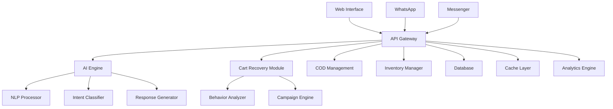

[retailbot_readme.md](https://github.com/user-attachments/files/21814853/retailbot_readme.md)
# 🤖 RetailBot Factory

<div align="center">


**The Ultimate No-Code AI Automation Suite for Retailers**

[](https://github.com/retailbot-factory/core)
[](LICENSE)
[](https://python.org)
[](https://nodejs.org)
[](https://docker.com)

[🚀 Quick Start](#-quick-start) • [📖 Documentation](#-documentation) • [🌟 Features](#-features) • [🔧 Installation](#-installation) • [💡 Examples](#-examples)

</div>

---

## ✨ What is RetailBot Factory?

RetailBot Factory revolutionizes e-commerce customer engagement by providing a comprehensive no-code platform for building intelligent conversational assistants. Purpose-built for retailers, it seamlessly integrates advanced AI capabilities with business-critical features like cart abandonment recovery, COD verification, and inventory management.

### 🎯 Perfect for

- **🛍️ E-commerce Stores** - Boost sales with intelligent product recommendations
- **📱 Multi-channel Retailers** - Unify customer experience across web, WhatsApp, and social media
- **🌍 Global Businesses** - Support for multiple languages and payment methods
- **📊 Data-driven Companies** - Advanced analytics and customer insights

---

## 🌟 Key Features

<table>
<tr>
<td width="50%">

### 🧠 **AI-Powered Conversations**
- Advanced Natural Language Processing
- Intent detection and entity extraction
- Multi-language support (French, Arabic, English)
- Context-aware responses

### 🛒 **Smart Cart Recovery**
- Real-time abandonment detection
- Personalized recovery campaigns
- Multi-channel engagement (Email, SMS, WhatsApp)
- Predictive behavioral analysis

</td>
<td width="50%">

### 💰 **COD Management**
- Risk scoring algorithms
- Automated verification processes
- Fraud detection and prevention
- Regional optimization for emerging markets

### 📦 **Inventory Intelligence**
- Real-time stock monitoring
- Predictive demand forecasting
- Automated restock notifications
- Alternative product recommendations

</td>
</tr>
</table>

### 🔗 **Seamless Integrations**

<div align="center">

| Platform | Status | Features |
|----------|--------|----------|
| **Shopify** | ✅ Full Support | Product sync, Order tracking, Customer data |
| **WooCommerce** | ✅ Full Support | Catalog integration, Payment processing |
| **WhatsApp Business** | ✅ Full Support | Rich messages, Templates, Webhooks |
| **Facebook Messenger** | ✅ Full Support | Interactive elements, Persistent menu |
| **Custom APIs** | ✅ Full Support | RESTful APIs, Webhooks, SDKs |

</div>

---

## 🚀 Quick Start

### Prerequisites

- **Python 3.11+**
- **Node.js 20+**
- **Database**: PostgreSQL/MySQL/SQLite
- **Memory**: 4GB RAM minimum
- **Storage**: 50GB available space

### 🔧 One-Click Installation

```bash
# Download the installer
curl -sSL https://install.retailbot-factory.com | bash

# Or use Docker
docker run -d \
  --name retailbot-factory \
  -p 80:80 -p 443:443 \
  -v retailbot_data:/app/data \
  retailbot/factory:latest
```

### 🌐 Web Interface Setup

1. **Access Dashboard**: Navigate to `http://your-domain.com`
2. **Complete Setup Wizard**: Follow the guided configuration
3. **Connect Integrations**: Link your e-commerce platform
4. **Deploy Your Bot**: Go live in minutes!

---

## 📖 Documentation

<div align="center">

| Resource | Description | Link |
|----------|-------------|------|
| 📚 **User Guide** | Complete setup and configuration guide | [View Guide](docs/user-guide.md) |
| 🔧 **API Reference** | RESTful API documentation | [API Docs](https://docs.retailbot-factory.com/api) |
| 🔌 **Integrations** | Platform-specific integration guides | [Integrations](docs/integrations/) |
| 🚀 **Deployment** | Production deployment strategies | [Deploy Guide](docs/deployment.md) |
| 🛠️ **Development** | SDKs and development resources | [Dev Resources](docs/development/) |

</div>

---

## 💡 Usage Examples

### 🛍️ E-commerce Integration

```python
from retailbot import RetailBotFactory

# Initialize the bot
bot = RetailBotFactory(
    name="ShopAssistant",
    language="en",
    platform="web"
)

# Configure Shopify integration
bot.integrate_shopify(
    shop_domain="your-shop.myshopify.com",
    access_token="your-access-token"
)

# Enable cart recovery
bot.enable_cart_recovery(
    triggers=["30s_inactive", "page_exit"],
    channels=["email", "whatsapp"],
    discount_strategy="progressive"
)

# Deploy the bot
bot.deploy()
```

### 📱 WhatsApp Business Setup

```javascript
const { RetailBot } = require('@retailbot/factory');

const bot = new RetailBot({
  name: 'WhatsAppAssistant',
  platform: 'whatsapp'
});

// Configure WhatsApp Business
await bot.integrateWhatsApp({
  phoneNumber: '+1234567890',
  businessAccountId: 'your-business-id',
  accessToken: 'your-access-token'
});

// Set up message templates
await bot.createTemplate({
  name: 'cart_reminder',
  category: 'MARKETING',
  language: 'en',
  components: [
    {
      type: 'BODY',
      text: 'Hi {{1}}! You left {{2}} items in your cart. Complete your purchase now and get 10% off!'
    },
    {
      type: 'BUTTONS',
      buttons: [
        { type: 'URL', text: 'Complete Purchase', url: '{{3}}' },
        { type: 'QUICK_REPLY', text: 'Remove from cart' }
      ]
    }
  ]
});
```

### 📊 Analytics Dashboard

```python
# Get conversation analytics
analytics = bot.get_analytics(
    start_date="2024-01-01",
    end_date="2024-01-31",
    metrics=["conversations", "conversions", "revenue"]
)

print(f"Total conversations: {analytics.total_conversations}")
print(f"Conversion rate: {analytics.conversion_rate}%")
print(f"Revenue generated: ${analytics.revenue}")

# Get cart recovery performance
recovery_stats = bot.get_cart_recovery_stats()
print(f"Recovery rate: {recovery_stats.recovery_rate}%")
print(f"Recovered revenue: ${recovery_stats.recovered_revenue}")
```

---

## 🏗️ Architecture

<div align="center">



</div>

### 🔧 Technology Stack

- **Backend**: Python (Flask), SQLAlchemy ORM
- **Frontend**: React, TypeScript, Tailwind CSS
- **Database**: PostgreSQL/MySQL with Redis caching
- **AI/ML**: Transformer models, scikit-learn
- **Infrastructure**: Docker, Kubernetes ready
- **Monitoring**: Prometheus, Grafana integration

---

## 🚀 Deployment Options

### ☁️ Cloud Deployment

<table>
<tr>
<td align="center" width="33%">

**AWS**
- EC2 + RDS
- ECS/EKS
- Lambda Functions
- CloudFormation

</td>
<td align="center" width="33%">

**Azure**
- App Service
- Azure Database
- Container Instances
- ARM Templates

</td>
<td align="center" width="33%">

**Google Cloud**
- Compute Engine
- Cloud SQL
- GKE
- Deployment Manager

</td>
</tr>
</table>

### 🏢 On-Premise

```yaml
# docker-compose.yml
version: '3.8'
services:
  retailbot-app:
    image: retailbot/factory:latest
    ports:
      - "80:80"
      - "443:443"
    environment:
      - DATABASE_URL=postgresql://user:pass@db:5432/retailbot
      - REDIS_URL=redis://redis:6379
    depends_on:
      - db
      - redis

  db:
    image: postgres:15
    environment:
      POSTGRES_DB: retailbot
      POSTGRES_USER: user
      POSTGRES_PASSWORD: password
    volumes:
      - postgres_data:/var/lib/postgresql/data

  redis:
    image: redis:7-alpine
    volumes:
      - redis_data:/data

volumes:
  postgres_data:
  redis_data:
```

---

## 📊 Performance & Scaling

### 📈 Benchmarks

| Metric | Standard | Enterprise |
|--------|----------|------------|
| **Concurrent Users** | 1,000+ | 10,000+ |
| **Response Time** | <200ms | <100ms |
| **Uptime** | 99.5% | 99.9% |
| **Throughput** | 1K req/sec | 10K req/sec |

### ⚡ Optimization Features

- **Smart Caching**: Multi-level caching strategy
- **Load Balancing**: Horizontal scaling support
- **Database Optimization**: Query optimization and indexing
- **CDN Integration**: Global content delivery
- **Auto-scaling**: Kubernetes HPA support

---

## 🔐 Security & Compliance

<div align="center">

| Feature | Status | Description |
|---------|--------|-------------|
| 🔒 **Data Encryption** | ✅ | TLS 1.3, AES-256 at rest |
| 🛡️ **Authentication** | ✅ | JWT, OAuth 2.0, MFA |
| 📋 **GDPR Compliance** | ✅ | Data portability, right to be forgotten |
| 🔍 **Audit Logging** | ✅ | Comprehensive security logs |
| 🚫 **Rate Limiting** | ✅ | DDoS protection |
| 🔐 **Secret Management** | ✅ | Encrypted configuration |

</div>

---

## 🤝 Contributing

We welcome contributions from the community! Here's how you can help:

### 🐛 Report Issues
- Use our [Issue Tracker](https://github.com/retailbot-factory/core/issues)
- Provide detailed reproduction steps
- Include environment information

### 💻 Submit Code
```bash
# Fork the repository
git clone https://github.com/your-username/retailbot-factory.git

# Create a feature branch
git checkout -b feature/amazing-feature

# Make your changes and commit
git commit -m "Add amazing feature"

# Push and create a pull request
git push origin feature/amazing-feature
```

### 📖 Improve Documentation
- Fix typos and improve clarity
- Add examples and use cases
- Translate to other languages

---

## 📞 Support & Community

<div align="center">

### 🆘 Get Help

[](https://discord.gg/retailbot-factory)
[](https://stackoverflow.com/questions/tagged/retailbot-factory)
[](https://docs.retailbot-factory.com)

### 💼 Enterprise Support

For enterprise deployments, custom integrations, and priority support:

📧 **Email**: stylebenderkh@gmail.com 
📞 **Phone**: +213 541095903  

</div>

---

## 📜 License

This project is licensed under a Proprietary License. See the [LICENSE](LICENSE) file for details.

**© 2025 RetailBot Factory. All rights reserved.**

---

## 🙏 Acknowledgments

- Built with ❤️ by [Yacine Khaldi](https://github.com/yacinekhaldi)
- Powered by state-of-the-art AI and machine learning
- Special thanks to our amazing community of contributors

---

<div align="center">

**Made with 🤖 for the future of retail**

[⭐ Star us on GitHub](https://github.com/retailbot-factory/core) • [🐦 Follow on Twitter](https://twitter.com/retailbot_factory) • [💼 LinkedIn](https://linkedin.com/company/retailbot-factory)

</div>
